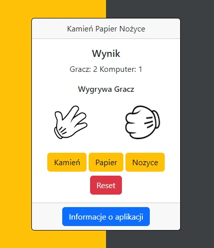

# :desktop_computer: RockScissorsPaper

The application randomly selects one of the three available moves: rock, paper, or scissors, and then displays the result of the match between the user's choice and the randomly generated move. The user or the computer receives a point for each winning match.

## :framed_picture: Screenshots

## :joystick: Demo

https://kamilkeder.github.io/RockScissorsPaper/

## :e-mail: Feedback

If you have any feedback, please reach out to me at kontaktkkeder@gmail.com
